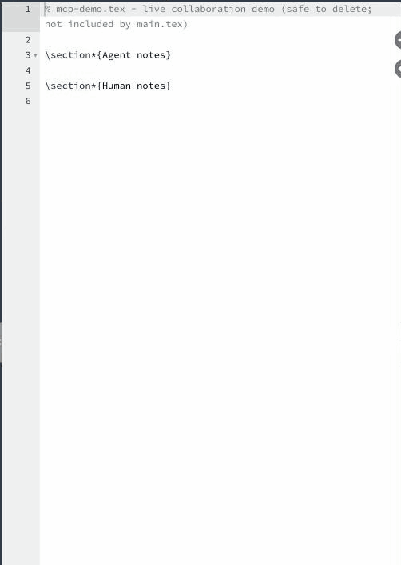

# Overleaf MCP

[](https://www.npmjs.com/package/overleaf-mcp-rt)
[](https://www.npmjs.com/package/overleaf-mcp-rt)
[](LICENSE)
[](https://nodejs.org/)

> **A real-time [Model Context Protocol](https://modelcontextprotocol.io/) server for Overleaf — self-hosted Community Edition / Server Pro *and* overleaf.com. No git-bridge, no fork, no extra infrastructure.**

**Overleaf MCP** lets AI coding agents (Claude Code, Claude Desktop, Codex, Cursor, Continue, and any other MCP-compliant client) read, edit, comment on and compile LaTeX projects on **your own Overleaf server or on [overleaf.com](https://www.overleaf.com)** — and on both at once, from one MCP server ([multiple hosts](#multiple-hosts)). Instead of going through a git-bridge — a paid feature that Community Edition installs don't have, and one that syncs in batches — it speaks Overleaf's **native operational-transform (OT) protocol over Socket.IO**, the approach pioneered by [**Overleaf-Workshop**](https://github.com/iamhyc/Overleaf-Workshop). The agent's edits arrive in the editor as a collaborator's keystrokes: no "file changed externally" toast, and people typing in the same file at the same time are never interrupted.

<p align="center">
  
  <br>
  <em>An agent and a person editing the same file at the same time. The person's comment lines are picked up by the agent as <code>&lt;external-changes&gt;</code> and acted on.</em>
</p>

Distributed on npm as **[`overleaf-mcp-rt`](https://www.npmjs.com/package/overleaf-mcp-rt)** — the `rt` suffix marks this as the **r**eal-**t**ime / OT-backed flavor, distinct from git-bridge–style Overleaf MCP servers.

```bash
npx overleaf-mcp-rt@latest --help
```

## Table of contents

- [Supported Overleaf servers](#supported-overleaf-servers)
- [Why "real-time"? Native OT vs git-bridge](#why-real-time-native-ot-vs-git-bridge)
- [Install](#install)
- [Quick start](#quick-start)
- [Multiple hosts](#multiple-hosts)
- [Agent skills](#agent-skills)
- [MCP client config](#mcp-client-config)
- [Sanity-check: `diagnose`](#sanity-check-diagnose)
- [Tools](#tools)
  - [Discovery & read](#discovery--read)
  - [Edit](#edit)
  - [Working alongside humans](#working-alongside-humans)
  - [Comments](#comments)
  - [Project tree CRUD](#project-tree-crud)
  - [Compile](#compile)
  - [Error envelope](#error-envelope)
- [Changelog](CHANGELOG.md)
- [Roadmap](#roadmap)
- [FAQ](#faq)
- [Developing](#developing)
- [License](#license)
- [Acknowledgements](#acknowledgements)

## Supported Overleaf servers

| | Self-hosted **Community Edition** | Self-hosted **Server Pro** | **overleaf.com** |
|---|---|---|---|
| Versions | stock 3.x – 6.x (6.x is the primary target) | same code base as CE ⁴ | current production |
| Read / edit / create / move / delete, live co-editing | ✅ | ✅ | ✅ ¹ |
| Compile, read the log, download the PDF | ✅ | ✅ | ✅ |
| `<external-changes>` reports of what people changed | ✅ | ✅ | ✅ |
| Review-panel comments | — ² | ✅ | ✅ |
| Login | `--browser`, email + password, or cookie | same | `--browser` or cookie ³ |
| Behind an auth proxy (Cloudflare Access, Basic Auth, …) | ✅ extra headers | ✅ extra headers | n/a |

¹ Except projects Overleaf has already migrated to its new *history-OT* format — see the [FAQ](#faq). Those fail cleanly on document reads and writes; nothing is corrupted.<br>
² Stock CE has no review panel, so the comment tools return `COMMENTS_UNSUPPORTED` without changing anything.<br>
³ overleaf.com's password form is CAPTCHA-protected, so email + password login can't work there.<br>
⁴ Server Pro shares CE's real-time and document services and the same review-panel API as overleaf.com, but has not been tested separately — reports welcome.

Nothing is installed on, or changed in, the Overleaf server: the MCP server is just another logged-in client. Live co-editing was verified against Community Edition 6.0.0 and against production overleaf.com with a person typing in the browser throughout — both sides ended byte-identical.

## Why "real-time"? Native OT vs git-bridge

|  | **Overleaf MCP** (native OT) | git-bridge–style MCP servers |
|---|---|---|
| Works on Community Edition | ✅ | ❌ (git-bridge is a Server Pro feature) |
| Works on overleaf.com | ✅ any plan you can log in to | only on plans with git integration |
| Latency to editor | live (per patch, ~100 ms) | minutes (git push + bridge sync) |
| Server requirements | none — stock CE 3.x – 6.x, Server Pro, or overleaf.com | Server Pro + git-bridge, or a paid overleaf.com plan |
| "File changed externally" toast | never — edits arrive as co-author OT ops | yes — every git sync triggers it |
| Someone typing in the same file | both edits survive (OT) | merge conflicts |
| Auth model | session cookie | git over HTTPS / token |

Whether your Overleaf runs in Docker on a homelab or is an overleaf.com account, if you want an AI coding agent to edit LaTeX in it with the edits showing up live in the browser, this is the project for you.

## Install

```bash
# A. Zero-install via npx (recommended for MCP clients)
npx overleaf-mcp-rt@latest --help

# B. Global install for shell use
npm install -g overleaf-mcp-rt
overleaf-mcp-rt --help
```

Requires Node.js ≥ 20.

### As a plugin (MCP server + skills together)

This repository is itself an installable agent plugin: the MCP server wiring plus four [agent skills](#agent-skills) and two slash commands.

| Harness | Install |
|---|---|
| **Claude Code** | `/plugin marketplace add DanielHou315/overleaf-mcp-rt` then `/plugin install overleaf-mcp-rt@overleaf-mcp-rt` |
| **Cursor** | Add this repository as a plugin marketplace (it ships `.cursor-plugin/` manifests and `mcp.json`), then install `overleaf-mcp-rt` |
| **Codex** | `codex plugin marketplace add DanielHou315/overleaf-mcp-rt` then `codex plugin add overleaf-mcp-rt@overleaf-mcp-rt` (the slash commands arrive as skills) |
| **Other harnesses** | Register the MCP server (see [MCP client config](#mcp-client-config)) and copy the skills: `npx -y overleaf-mcp-rt skills install --target <your skills dir>` |

Then log in once from a terminal: `npx -y overleaf-mcp-rt login --url <your Overleaf> --browser`.

## Quick start

```bash
# 1. Sign in: opens a browser window, you log in as usual, the session is captured
npx overleaf-mcp-rt login --url https://overleaf.example.com --browser

# 2. Smoke test connectivity, auth, and OT handshake
npx overleaf-mcp-rt diagnose

# 3. List your projects
npx overleaf-mcp-rt ls
```

## Multiple hosts

One server can be logged in to several Overleaf instances at once — say a self-hosted CE box and overleaf.com. Run `login` once per instance:

```bash
npx overleaf-mcp-rt login --url https://tex.example.org                      # first host becomes the default
npx overleaf-mcp-rt login --url https://www.overleaf.com --name overleaf.com # add another (--default to switch the default)
npx overleaf-mcp-rt hosts                                                    # names + URLs, never secrets
npx overleaf-mcp-rt diagnose --host overleaf.com
```

- A host's name defaults to its hostname without `www.`; `--name` overrides it. Logging in again under the same name just refreshes that host's cookie.
- Every MCP tool takes an optional **`host`** argument, and `overleaf_list_hosts` tells the agent what exists. Selection is per call rather than a "current host" switch, so parallel tool calls can't race each other onto the wrong instance. Omit `host` to use the default. Project ids only mean something on the host they came from.
- Each host has its own session, OT connections and external-change tracking. Hosts are authenticated on first use, and the credentials file is re-read on every call, so you can add or refresh a host while the MCP server is running.
- Credentials live in `~/.config/overleaf-mcp-rt/credentials.json` (mode 0600) as `{ "default": "<name>", "hosts": { "<name>": { url, session_cookie, extra_headers } } }`. The single-host file written by earlier versions is still read and is upgraded in place by the next `login`. `OVERLEAF_CREDENTIALS_FILE` relocates the file. `OVERLEAF_URL` / `OVERLEAF_SESSION_COOKIE` / `OVERLEAF_EXTRA_HEADERS` still work: they define (or override) the host for that URL and make it the default.
- **Browser login (`--browser`, the default choice at the prompt):** Overleaf has no OAuth or device flow for third-party clients, and hosted instances put CAPTCHA, SSO or 2FA in front of the password form — so the login that always works is the real one in a real browser. `login --browser` launches your installed Chrome / Chromium / Edge / Brave with a **throwaway profile** (your everyday profile is never touched), opens the instance's login page, and waits. Once you're signed in it reads the session cookie over the DevTools protocol (which, unlike page JavaScript, can see `HttpOnly` cookies), validates it, saves it, closes the window and deletes the profile. With `--url` and `--browser` both given there are no prompts, so it also works from non-interactive runners. `OVERLEAF_BROWSER=/path/to/browser` picks a specific binary. `--cookie` and `--email` remain for headless machines.
- **Pasting a cookie:** `login` accepts either the bare value or `name=value`, and works out whether the instance wants `overleaf_session2` (overleaf.com), `overleaf.sid` (CE ≥ 5) or `sharelatex.sid` (older CE). Use it where `--browser` isn't possible (a headless machine): in your browser's devtools open Application → Cookies → `https://www.overleaf.com` and copy `overleaf_session2`.

## Agent skills

Small, on-demand instructions that teach an agent to use these tools well. They cost a few hundred tokens until one is actually needed.

| Skill | Teaches |
|---|---|
| `overleaf-setup` | Installing, logging in (`--browser`), multiple hosts, `diagnose`, and what each auth/config error means. |
| `overleaf-editing` | The read → `overleaf_edit_doc` loop, unique `old_string`s, small edits, reading `<external-changes>`, never reverting a human, why to avoid `overleaf_write_doc`. |
| `overleaf-latex-workflow` | Finding the root file, matching project conventions, compile → read log → fix, leaving the project building, citations and figures. |
| `overleaf-comments` | Comment vs. edit, the required `Co-authored by <agent name>` signature, replying and resolving, the fallback where comments don't exist. |

Slash commands: `/overleaf-login` (walks the user through a browser login) and `/overleaf-status` (hosts, sessions, what to fix).

They are plain `SKILL.md` folders in [`skills/`](skills/), written for any agent — no model- or vendor-specific instructions. Installed with the plugin, or copied anywhere with `overleaf-mcp-rt skills install [--target <dir>]` (default `~/.claude/skills`); `overleaf-mcp-rt skills` lists them.

## MCP client config

Works in Claude Code, Claude Desktop, Cursor, Codex (via MCP), Continue, and any MCP-compliant client.

```jsonc
{
  "mcpServers": {
    "overleaf": {
      "command": "npx",
      "args": ["-y", "overleaf-mcp-rt@latest"],
      "env": {
        "OVERLEAF_URL": "https://overleaf.example.com",
        "OVERLEAF_SESSION_COOKIE": "overleaf_session2=s%3A..."
      }
    }
  }
}
```

If your Overleaf is fronted by an authentication proxy (Cloudflare Access, Authelia, oauth2-proxy, HTTP Basic Auth, etc.), pass the proxy headers via the optional `OVERLEAF_EXTRA_HEADERS` env var as a JSON object — its keys/values are merged into every REST request and the Socket.IO upgrade. Run `diagnose` (next section) to verify both layers.

## Sanity-check: `diagnose`

After wiring credentials, run from a shell:

```bash
overleaf-mcp-rt diagnose
```

Output is a step-by-step report:

```
✓ config — URL https://overleaf.example.com
✓ REST handshake — cookie valid, CSRF scraped
✓ project listing — 3 project(s) accessible
✓ OT handshake — publicId P.abc...
```

A `✗` on any step prints the underlying error code (`OVERLEAF_AUTH_FAILED`, `PROXY_AUTH_FAILED`, `PROJECT_ACCESS_DENIED`) so you know which layer to fix. When a step fails in a way that looks like an authentication proxy (a redirect to a sign-in page that isn't Overleaf's, or a 401/403) and no extra headers are configured, the report says so. A CDN that merely sits in front of a working instance is not reported — it needs no configuration.

## Tools

22 MCP tools, all prefixed `overleaf_*` so they remain unambiguous in hosts that don't auto-namespace by server name. Every tool's error responses use the [structured error envelope](#error-envelope).

### Discovery & read

| Tool | Purpose |
|---|---|
| `overleaf_list_hosts` | The Overleaf instances this server is logged in to, and which is the default. Every other tool accepts an optional `host` — see [Multiple hosts](#multiple-hosts). |
| `overleaf_list_projects` | List accessible projects. |
| `overleaf_get_project_tree(projectId)` | Folder + file tree (live, OT-backed). |
| `overleaf_read_doc(projectId, path)` | Full text doc content. Live: reflects collaborators' keystrokes up to the instant of the call. |
| `overleaf_check_changes(projectId)` | What collaborators changed since the agent's last tool call. The same report rides along on every other tool result (see [Working alongside humans](#working-alongside-humans)), so this is only for polling. |
| `overleaf_read_doc_range(projectId, path, startLine?, endLine?, startOffset?, length?)` | Substring of a doc by 1-indexed inclusive line range or by char offset/length. Returns `totalLines` / `totalChars`. Use this to verify a small region after an edit instead of re-fetching the whole doc. |
| `overleaf_read_file(projectId, path, as?)` | Binary file. Default `as=auto`: native MCP image content for image MIMEs, text content for text MIMEs, resource for PDFs, base64 envelope otherwise. Pass `as=base64` to force the `{contentBase64, mimeType}` envelope for any type — useful for programmatic copy via `overleaf_upload_file`. |

### Edit

| Tool | Purpose |
|---|---|
| **`overleaf_edit_doc(projectId, path, edits[], dryRun?)`** | **The recommended editing surface.** Exact string replacement, the way coding agents edit files: each edit is `{old_string, new_string, replace_all?}`. Returns a write summary plus a unified `diff` of what changed. |
| `overleaf_write_doc(projectId, path, content, overwrite?)` | Replace a whole doc. Only the differing characters are sent. Refused if the agent hasn't read the doc this session (`DOC_NOT_READ`) or a collaborator edited it since (`DOC_CHANGED_EXTERNALLY`), unless `overwrite: true`. |

#### `overleaf_edit_doc`

```json
{ "projectId": "…", "path": "main.tex", "edits": [
  { "old_string": "Results are good.", "new_string": "Results are excellent." },
  { "old_string": "\\cite{old}", "new_string": "\\cite{new}", "replace_all": true }
] }
```

- `old_string` must identify **exactly one** place in the doc, or the call fails with `EDIT_AMBIGUOUS` and the matching line numbers — add surrounding text, or set `replace_all`.
- Edits apply **in order**, each to the result of the previous, and **atomically**: if any edit fails, nothing is sent.
- Text is addressed by content, never by offset, and matched against the **live** doc at the instant the op is emitted. An agent edit therefore composes with whatever a human is typing elsewhere in the file. If the human changed the very text being targeted, the call fails with `EDIT_NO_MATCH`, reports the closest region, and the attached `<external-changes>` block shows their edit.
- If `old_string` isn't found verbatim, a match that differs only in trailing whitespace, indentation, or line wrapping is accepted **when unambiguous** (reported in `notes`). The replaced span is always the doc's real text.
- The op sent to Overleaf is the minimal character diff, so collaborators' cursors and selections outside the changed characters are undisturbed.
- To insert, use an anchor as `old_string` and repeat it in `new_string`. To delete, pass `new_string: ""`. `dryRun: true` returns the diff and resolved OT ops without sending.

Legacy v1.1 edits carrying a `mode` field (`replace`, `insert_before`, `insert_after`, `replace_lines`, `unified_diff`, `raw_ops`) are still accepted. `replace_lines` and `raw_ops` address the doc by position, so they are refused with `DOC_CHANGED_EXTERNALLY` if a collaborator edited the doc since the agent last saw it.

### Working alongside humans

The server keeps a live, server-confirmed copy of every doc the agent has opened by applying each collaborator's OT op as it arrives, so the agent always edits the current version. On top of that it remembers what the agent has *been shown*. Whenever those differ, the next tool result for that project (success or error) gets an extra text block:

```
<external-changes>
Collaborators changed this project since your last tool call. …

main.tex — edited by Ada Lovelace, 12s ago (v41 → v45)
@@ -1,3 +1,3 @@
 \section{Introduction}
-We study the problem of widgets.
+We study the problem of gadgets.

File tree:
- created doc appendix.tex by Ada Lovelace
</external-changes>
```

This is the Overleaf analogue of a coding agent noticing a file changed on disk: the agent stays current without re-reading, and each change is reported once. Only docs the agent has read are reported; the agent's own edits never are.

### Comments

Review-panel comment threads, for feedback that belongs *next to* a passage rather than in it. **Available on overleaf.com and Server Pro.** Stock Community Edition has no review panel (the thread API ships in Server Pro's proprietary module), so there these tools fail up front with `COMMENTS_UNSUPPORTED` and change nothing.

| Tool | Purpose |
|---|---|
| `overleaf_list_comments(projectId, path, includeResolved?)` | Threads attached to a doc: thread id, line, the text each is anchored to, resolved state, and every message with its author. Anchors follow the text live as people edit. |
| `overleaf_add_comment(projectId, path, anchorText, content, agentName, omitSignature?)` | Attach a new comment to a span of text without changing it. `anchorText` must match exactly one place (same matching rules as `old_string`); a bad anchor creates nothing. |
| `overleaf_reply_comment(projectId, threadId, content, agentName, omitSignature?)` | Reply in an existing thread. Refuses unknown thread ids rather than creating an orphan thread. |
| `overleaf_resolve_comment(projectId, path, threadId, resolved?)` | Resolve a thread, or reopen it with `resolved: false`. |

**Signature rule.** Comments are posted through the logged-in Overleaf account — on overleaf.com usually the human's *own* — so Overleaf shows the human as the author and nobody could otherwise tell the agent's words from theirs. Every agent comment therefore ends with `Co-authored by <agent name>`. This is stated in the tool descriptions and in the server's MCP `instructions`, and it is **enforced by the server**: `agentName` is required and the line is appended for the agent (never doubled). `omitSignature: true` exists for the case where the user has explicitly asked for unsigned comments.

### Project tree CRUD

| Tool | Purpose |
|---|---|
| `overleaf_create_doc(projectId, parentPath, name, content?)` | Create a text doc; optional initial content is OT-written after creation. Use `parentPath: ""` for the project root. |
| `overleaf_create_folder(projectId, parentPath, name)` | Create a folder. |
| `overleaf_upload_file(projectId, parentPath, name, contentBase64, mimeType?)` | Upload a binary; mimeType inferred from extension when omitted. The server may auto-promote text MIME types to docs. |
| `overleaf_rename(projectId, path, newName)` | Rename a doc/file/folder. |
| `overleaf_move(projectId, path, newParentPath)` | Move a doc/file/folder. Use `newParentPath: ""` for the project root. |
| `overleaf_delete_entity(projectId, path)` | Delete a doc/file/folder. |

### Compile

| Tool | Purpose |
|---|---|
| `overleaf_compile(projectId, draft?, stopOnFirstError?)` | Trigger a LaTeX compile, return output URLs. |
| `overleaf_read_compile_log(projectId)` | Compile and return `output.log` text. |
| `overleaf_download_pdf(projectId)` | Compile and return the PDF as an MCP resource (`application/pdf`, base64 blob). |

### Error envelope

Every tool error serializes as JSON inside an MCP `text` content block (with `isError: true`):

```json
{
  "code": "OT_DELETE_MISMATCH",
  "message": "Delete op #0 at position 0 expected \"FOO\" but doc has \"BAR\"",
  "context": { "p": 0, "expected": "FOO", "actual": "BAR", "opIndex": 0 },
  "retryable": false,
  "hint": "The d-string did not match the doc at position p. Re-read the doc to get the current text, then recompute offsets."
}
```

| Code | Meaning |
|---|---|
| `OVERLEAF_GENERIC` | Validation or other non-typed errors (ambiguous anchor, out-of-bounds line range, mixed-mode `edit_doc`, etc.). |
| `OVERLEAF_AUTH_FAILED` | Session cookie invalid/expired. Re-run `overleaf-mcp-rt login`. |
| `PROXY_AUTH_FAILED` | A reverse proxy blocked the request — set `OVERLEAF_EXTRA_HEADERS`. |
| `PROJECT_ACCESS_DENIED` | The session can't reach the requested project. |
| `NOT_FOUND` | No such doc/file/folder at the given path. |
| `NETWORK_ERROR` | Transport-level failure (`retryable: true`). |
| `OT_DELETE_MISMATCH` | A `d`-string in `overleaf_edit_doc`'s `raw_ops` mode didn't match the doc at `p`. Pre-validated client-side, so you find out before the round-trip. |
| `EDIT_NO_MATCH` | `old_string` (or a `unified_diff`'s context) isn't in the live doc. `context.closest` holds the most similar region. |
| `EDIT_AMBIGUOUS` | `old_string` matches more than one place; `context.lines` lists them. |
| `DOC_CHANGED_EXTERNALLY` | A collaborator edited the doc after the agent last saw it, and the requested operation (`overleaf_write_doc`, `replace_lines`, `raw_ops`) depends on that stale view. Nothing was written. |
| `DOC_NOT_READ` | `overleaf_write_doc` on a non-empty doc the agent never read. |
| `COMMENTS_UNSUPPORTED` | The instance has no comment threads (stock Community Edition). Nothing was changed. |
| `INVALID_CONFIG` | Missing or malformed `OVERLEAF_URL` / cookie / extra headers. |

`retryable: true` is set for transient failures (`NETWORK_ERROR`); agents can use it to drive a retry loop. `hint` provides a one-line next step for the most common failures.

## Roadmap

### v1.x — full CLI parity

Today every tool listed above is reachable via MCP only; the bundled CLI just covers `login`, `ls`, and `diagnose`. Some agents (Codex CLI, Aider, terminal-only setups, anything that would rather shell out than pay tokens on an MCP envelope) are happier driving a normal command-line tool. Planned for v1.x:

- **CLI parity for every MCP tool** — one subcommand per tool, JSON output by default so agents can parse it, `--human` for tty-friendly tables. Sketch:
  - `overleaf-mcp-rt projects ls` / `tree <projectId>`
  - `overleaf-mcp-rt doc read <projectId> <path>` / `write <projectId> <path>` (stdin) / `edit <projectId> <path> <edits.json>` / `patch <projectId> <path> <ops.json>`
  - `overleaf-mcp-rt file read <projectId> <path>` / `upload <projectId> <parentPath> <name> <file>`
  - `overleaf-mcp-rt fs mkdir | mv | rm | rename`
  - `overleaf-mcp-rt compile <projectId> [--draft] [--stop-on-first-error]` / `log` / `pdf -o out.pdf`
- **CLI-flavoured skills** — the shipped [agent skills](#agent-skills) teach the MCP tools; once the CLI has parity they will cover it too.
- **Same env, two surfaces** — `OVERLEAF_URL` / `OVERLEAF_SESSION_COOKIE` / `OVERLEAF_EXTRA_HEADERS` apply to both modes. The MCP server stays the default invocation for back-compat; the CLI is additive.

### Beyond v1.x

- Cursor rules and Continue tool definitions in a `recipes/` directory.
- `overleaf-mcp-rt watch` — mirror a local directory into a project as you edit it, for non-MCP workflows.
- Optional in-process snapshot history for project-level rollback.

Track or contribute via [GitHub issues](https://github.com/DanielHou315/overleaf-mcp-rt/issues).

## FAQ

**Does this require Overleaf Server Pro?**
No. It works on stock **Overleaf Community Edition** (3.x – 6.x), on Server Pro, and on overleaf.com — see [Supported Overleaf servers](#supported-overleaf-servers). Only the comment tools need Server Pro or overleaf.com, because stock CE has no review panel.

**Does this require git-bridge?**
No. Edits are sent as live OT operations over Socket.IO — the same protocol Overleaf's web editor uses internally.

**Will edits show a "file changed externally" toast in the browser?**
No. The MCP server connects as a regular collaborator, so other browser sessions see edits as a co-author typing.

**Does it work with overleaf.com (the hosted SaaS)?**
Yes, for projects on Overleaf's classic OT pipeline. Verified live against production overleaf.com: reads, string edits, create/delete, external-change reports, and an agent editing while a human typed in the browser in three places — both sides ended byte-identical, with agent edits showing up in the browser editor ~100 ms after being sent. Things to know:

- **Log in with `login --url https://www.overleaf.com --name overleaf.com --browser`** — the password form is CAPTCHA-protected, so email/password login can't work there. Pasting a cookie also works; if devtools shows two `overleaf_session2` cookies, use the one for the `.overleaf.com` domain — `login` validates whatever you paste before saving it.
- The server fetches overleaf.com's load-balancer stickiness cookie (`GCLB`) automatically so the Socket.IO handshake and websocket reach the same backend.
- **history-OT projects are not supported yet.** Overleaf is migrating projects to a new OT format (`otMigrationStage` > 0). For those, overleaf.com refuses `joinDoc` from clients that don't speak it, so doc reads/writes fail with a clear error (nothing is corrupted); REST-backed tools (`list_projects`, `compile`, `download_pdf`, tree operations) still work. You can check a project by looking for `<meta name="ol-otMigrationStage">` on its editor page.
- You are automating your own account on a shared production service: keep edit rates humane. This project is not affiliated with Overleaf.

**Does it work behind a reverse proxy?**
Yes. Pass any required headers (Cloudflare Access service token, Basic Auth, oauth2-proxy / Authelia forwarded-user, etc.) via `OVERLEAF_EXTRA_HEADERS` as a JSON object — they're merged into both REST and Socket.IO. Run `overleaf-mcp-rt diagnose` after configuring; a missing header surfaces as `OVERLEAF_AUTH_FAILED` on the REST step or `OT connectionRejected` on the OT step.

**How does this compare to [Overleaf-Workshop](https://github.com/iamhyc/Overleaf-Workshop)?**
Overleaf-Workshop is the VS Code extension that pioneered speaking Overleaf's native OT/Socket.IO protocol from outside the browser. This project ports significant portions of its auth and OT client into a Model Context Protocol server, so any MCP-compatible AI agent — not just a VS Code user — can edit Overleaf projects in real time. Both are AGPL-3.0.

**Why is the npm package `overleaf-mcp-rt` if the project is called "Overleaf MCP"?**
The `rt` suffix marks this as the **r**eal-**t**ime / OT-backed flavor, since other "overleaf-mcp"–style packages may use git-bridge or zip-snapshot approaches. The shorter "Overleaf MCP" is the human-readable project name.

## Developing

```bash
npm ci && npm run typecheck && npm test && npm run build
```

**Live tests against real Overleaf servers** live in [`test/live/`](test/live/README.md): `test/live/run-matrix.sh` runs the built server against a throw-away Community Edition of every supported major (4.x – 6.x) on a Docker host — no published ports, an internal network, everything removed afterwards — and `LIVE_HOST=overleaf.com npm run test:live` runs the same suite against a host you are logged in to. They are not part of `npm test`.

**Repository layout = plugin layout.** The repo root is the plugin root, shared by every harness:

```
.claude-plugin/   plugin.json (declares the MCP server) + marketplace.json   → Claude Code
.cursor-plugin/   plugin.json + marketplace.json; mcp.json at the root       → Cursor
.codex-plugin/    plugin.json + mcp.json (catalog: .claude-plugin/marketplace.json) → Codex
skills/  commands/                                                           → shared components
scripts/mcp-launch.mjs   starts the server for the plugin: local dist/ if built, else the npm release matching the plugin version
src/  test/  dist/       the MCP server itself (npm package `overleaf-mcp-rt`)
```

There is deliberately **no `.mcp.json` at the root**: Claude Code would load it both as this project's config and as the plugin's, and `${CLAUDE_PLUGIN_ROOT}` only exists in the second case. The server is declared inline in `.claude-plugin/plugin.json` instead. Codex does not expand that variable at all, which is why it has its own manifest: `.codex-plugin/mcp.json` starts the launcher by a relative path with `cwd` at the plugin root.

**Testing the plugin from a checkout** (uses your local build, no publish needed):

```bash
npm run build
claude plugin validate .
```
```
/plugin marketplace add /absolute/path/to/overleaf-mcp-rt
/plugin install overleaf-mcp-rt@overleaf-mcp-rt
```

`claude mcp list` should show `plugin:overleaf-mcp-rt:overleaf … ✔ Connected`. For a local install the plugin root is the checkout itself, so `npm run build` is picked up on the next session without reinstalling. Codex, against a throwaway config so your real one is untouched:

```bash
export CODEX_HOME=$(mktemp -d)
codex plugin marketplace add /absolute/path/to/overleaf-mcp-rt
codex plugin add overleaf-mcp-rt@overleaf-mcp-rt
codex mcp list        # overleaf → node ./scripts/mcp-launch.mjs, cwd = the installed plugin root
```

The three `plugin.json` files, both `marketplace.json` files and `package.json` must agree on name/version/description — `test/unit/skills.test.ts` enforces it.

## License

[**AGPL-3.0-or-later**](LICENSE). Required because this project ports significant portions of code from [Overleaf-Workshop](https://github.com/iamhyc/Overleaf-Workshop) (also AGPL-3.0).

## Acknowledgements

This project ports significant portions of the auth and OT code from [**Overleaf-Workshop**](https://github.com/iamhyc/Overleaf-Workshop) by iamhyc and contributors. Used under AGPL-3.0.

Built on the [Model Context Protocol](https://modelcontextprotocol.io/).

---

**Keywords:** Overleaf · ShareLaTeX · MCP · Model Context Protocol · Claude Code · Claude Desktop · Codex · Cursor · Continue · LaTeX · self-hosted Overleaf · Overleaf Community Edition · operational transform · Socket.IO · git-bridge alternative · AI LaTeX agent · real-time collaborative editing
